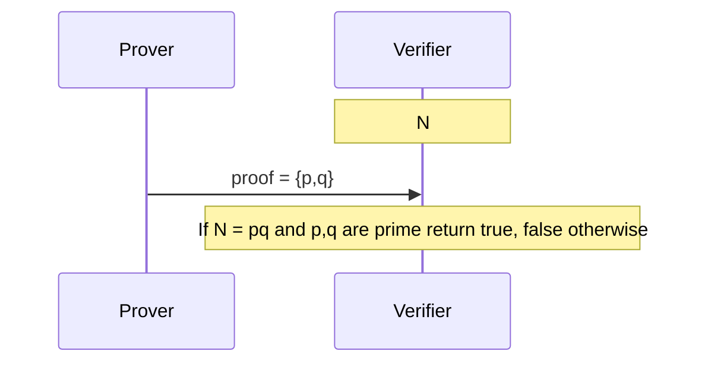
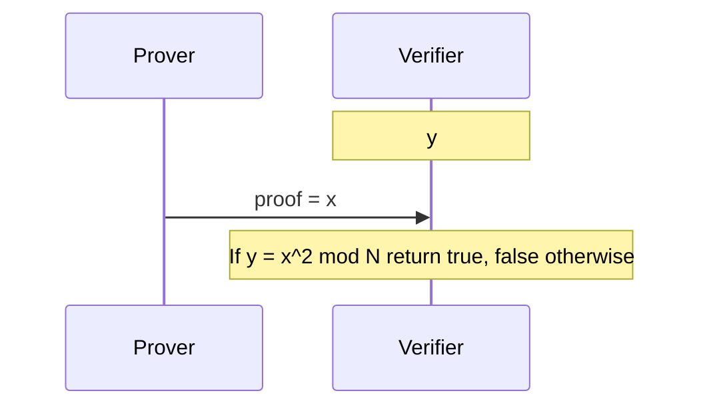
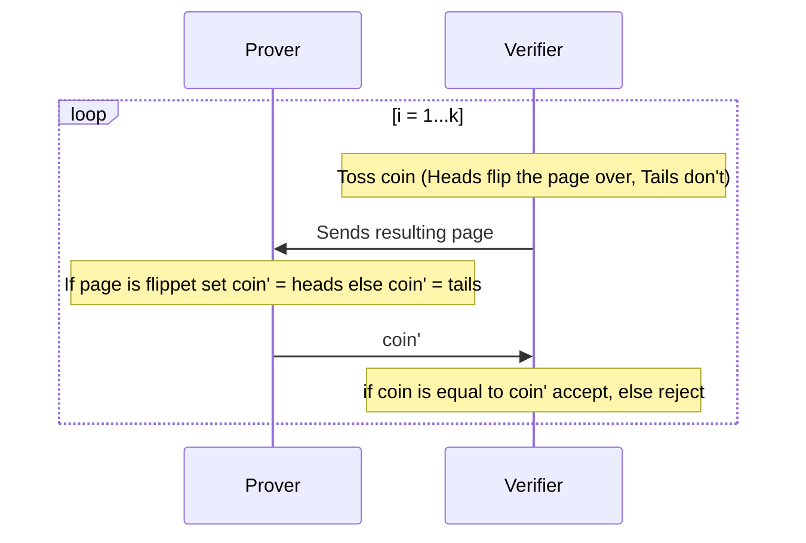
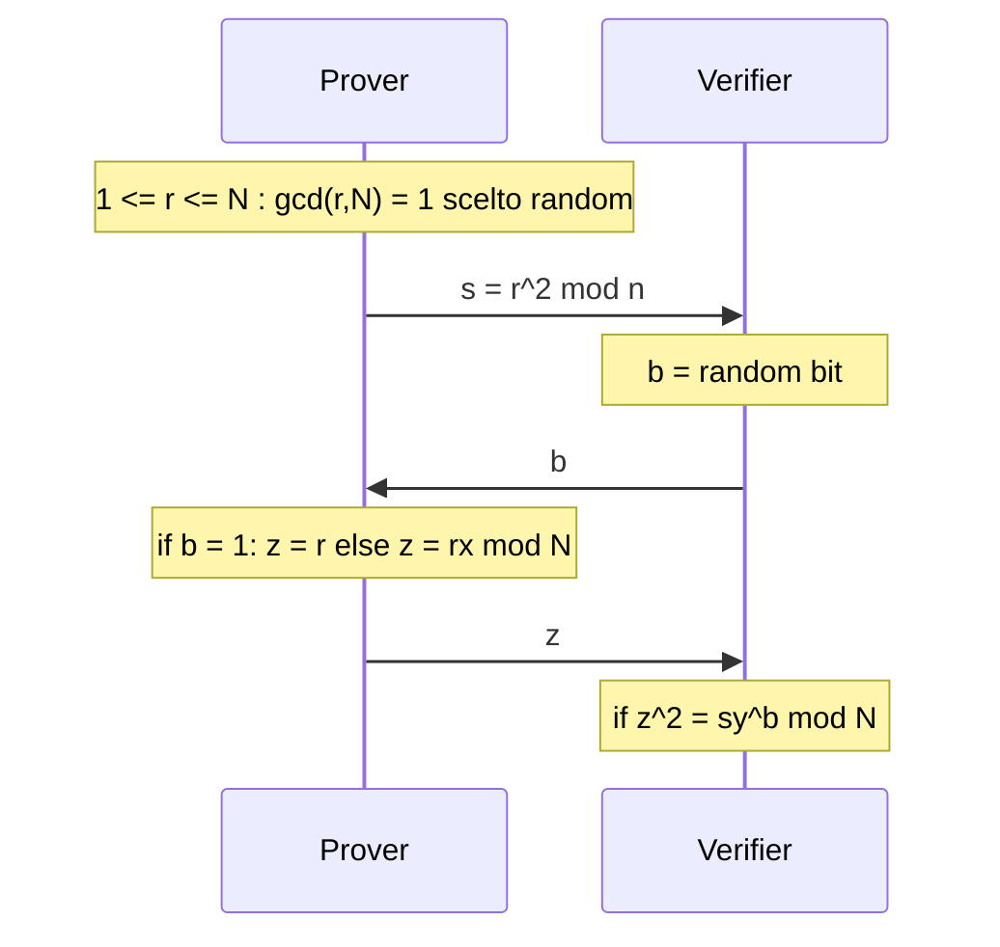

# Lecture 1: Introduction and History of Zero-Knowledge Proof
In questa lezione faremo un'introduzione alle Zero-Knowledge Proof e alla loro storia.

## Proof
Il primo concetto che dobbiamo formalizzare è quello di *dimostrazione*.
Nel contesto in cui ci troviamo, parleremo di dimostrazioni interattive in cui sono presenti due parti che condividono una *claim*. In particolare, le due parti coinvolte sono le seguenti:
- **Prover**: colui che deve fornire una prova del fatto che il fatto sia vero; assumeremo, almeno per il momento, che il Prover abbia capacità computazionali illimitate;
- **Verifier**:colui che deve verificare (accettare o rifiutare) la prova ottenuta dal *prover*; assumeremo che il verifier sia polinomialmente limitato;

## Efficiently Verifiable Proofs (NP-Proofs)
Le Efficiently Verifiable Proof (o NP-Proof) rappresentano delle prove in cui la prova è piccola e, di conseguenza, facilmente verificabile da parte del Verifier.
Formalmente, la taglia della prova deve essere polinomiale rispetto alla taglia della claim.

## Esempio 1
### Claim: $N$ è il prodotto di due numeri primi
In questo esempio vogliamo dimostrare che un numero $N$, noto al Prover e al Verifier, è un prodotto di due numeri primi $p,q$.

Il Verifier, una volta ricevuta la proof, potrà verificare la proprietà in tempo polinomiale (moltiplicazione $pq$ e test di primalità su $p$ e $q$).

Al termine dell'interazione, il Verifier conoscerà però la scomposizione in fattori primi di $N$.

## Example 2
### Claim: $\exists x \in Z_N^* : y = x^2 \, mod \, N$
In questo esempio vogliamo dimostrare che un numero $y$ è un quadrato residuo modulo $N$. Sappiamo che questo problema è difficile in $Z_N^*$.

Dopo l'interazione, il Verifier potrà verifcare che $y$ è un quadrato residuo modulo $N$ ma conoscerà anche la radice quadrata di $y$, ovvero $x$.

## Esempio 3
### Claim: due grafi sono isomorfi
Supponiamo di avere due grafi $G_0$ e $G_1$, diremo che questi sono isomorfi. Affinché due grafi $G_0,G_1$ siano isomorfi devono valere le seguenti condizioni:
1. hanno lo stesso ordine e la stessa dimensione (stesso numer di vertici e di archi);
2. hanno la stessa sequenza grafica, ovvero hanno lo stesso vettore ordinato dei gradi dei nodi componenti il grafo.

Ricordiamo che il grado di un nodo è il numero di nodi ai quali è collegato.

In questo caso, il Prover invia al Verifier l'isomorfismo $\pi = [N] \rightarrow [N]$. Il Verifier restituisce True se $$\forall i,j (\pi(i), \pi(j)) \in E_1 \iff (i,j) \in G_0$$

## Efficiently Verifiable Proofs (NP-Languages)
Gli esempi che abbiamo visto sono tutte NP-Proof.

Le claim che abbiamo visto sono, in realtà, linguaggi.

### Definizione di linguaggio
Un linguaggio $L$ è un insieme di stringhe binarie $x$ che soddisfano una qualche proprietà.

### Definizione di linguaggio NP
Un linguaggio $\mathcal{L}$ è un linguaggio *NP* (o NP-decision problem), se esiste un verifier $V$ polinomialmente limitato ($poly(|x|)$) per cui valgono le seguenti proprietà
- **Completeness** se $x \in \mathcal{L}$ esiste una prova $poly(|x|)$-long $w \in \{0,1\}^* : V(x,w)=1$; 
- **Soundness** se $x \notin \mathcal{L} \forall w \in \{0,1\}^*, V(x,w) = 0$

Tra il 1982 e il 1985 un team di ricerca, costituito da Micali, Goldwasser e Rackoff, si chiese se ero possibile fornire una dimostrazione interattiva dell'esempio 2 ($y$ è un quadrato residuo modulo $N$), senza dover fornire al Verifier la radice $x$. Da questo tentativo nascono le Zero-Knowledge Proof.

## Zero Knowledge Interactive Proof
Le prove interattive che abbiamo visto fino ad ora erano estremamente banali e si limitavano, semplicemente, a fornire al Verifier una prova della claim.

Per arrivare al concetto di Zero Knowledge Interactive Proof abbiamo bisogno di due ulteriori "ingredienti":
- **Interaction**: il Verifier non deve più limitarsi solo a leggere la prova passivamente ma deve interagire in modo non banale con il Prover;
- **Randomness**: il Verifier esegue un algoritmo randomizzato; le domande che verranno fatte al Prover non sono deterministiche. Inoltre, il Verifier accetta o rifiuta una prova con una certa probabilità di errore.

### Esempio 1
#### Due colori sono differenti
In questo esempio vogliamo che il Prover dimostri che una pagina è fatta da due colori distinti.
Ad ogni passo, il Verifier lancia una monetina per decidere se ruotare la pagina (Testa -> ruoto la pagina, Croce -> lascio la pagina inalterata) e la invia al Prover.
Se la pagina è stata ruotata, il Prover restituisce Testa al Verifier, Croce altrimenti.

Ad ogni passo della dimostrazione vengono eseguiti i seguenti passi:
1. il Verifier lancia una monetina e se ottiene Testa ruota l'immagine di partenza, altrimenti la lascia inalterata. Questa immagine viene inviata al Prover.
2. il Prover, ricevuta l'immagine del Verifier, invia al Verifier Testa se riscontra che l'immagine è stata ruotata, croce altrimenti.
3. il Verifier accetta se il Prover ha restituito la stessa faccia della monetina lanciata al passo 1

#### Analisi
- Se la pagina contiene due colori, il Verifier accetterà
- Se la pagina contiene un solo colore preso un qualsiasi Prover la probabilità di indovinare la faccia della moneta è pari a $1/2$, ovvero $Prob_{coins}(Verifier Accept) \leq 1/2$. Inoltre se ripetiamo l'esperimento $k$ volte: $Prob_{coins}(Verifier Accept) \leq 1/2^k$.

### Esempio 2
#### $y$ è quadrato residuo modulo $N$
Torniamo al problema che volevamo risolvere: dimostrare che $y$ è un quadrato residuo modulo $N$. Per semplicità indicheremo con $x$ la radice quadrata di $y$ modulo $N$.

##### Analisi
- Se $y$ è quadrato residuo allora il Verifier accetterà
- Soundness: se $y$ non è quadrato residuo modulo $N$ allora $\forall$ prover $Prob_{Coins}(Verifier accept) \leq 1/2$. Se ripetiamo l'esperimento $k$ volte avremo che $\forall$ prover $Prob_{Coins}(Verifier accept) \leq 1/2^k$.

## Interactive Proofs for a Language $\mathcal{L}$
### Definizione (intuitiva)
$(P,V)$ è un interactive proof per $\mathcal{L}$ se $V$ è probabilistico e polinomialmente limitato ($poly(|x|)$) e valgono le seguenti proprietà
- **Completeness**: se $x \in \mathcal{L}$, $V$ accetta sempre
- **Soundness**: se $x \notin \mathcal{L}$ $\forall$ cheating prover strategy $V$ non accetta con alta probabilità (accetta con probabilità trascurabile).

### Definizione (formale)
$(P,V)$ è un interactive proof per $\mathcal{L}$ se $V$ è probabilistico e polinomialmente limitato ($poly(|x|)$) e valgono le seguenti proprietà
- **Completeness**: se $x \in \mathcal{L}, Pr[(P,V)(x) = accept] = 1$
- **Soundness**: se $x \notin \mathcal{L}, \forall P^*$, $Pr[(P^*,V)(x) = accept] = negl(|x|)$

dove $negl(\lambda) < \frac{1}{polynomial(\lambda)}$ per tutte le funzioni polinomiali.

In alcuni casi non è possibile ottenere tali probabilità e, per questa ragione, dobbiamo tollerare una certa probabilità di errore.

### Definizione
$(P,V)$ è un interactive proof per $\mathcal{L}$ se $V$ è probabilistico e polinomialmente limitato ($poly(|x|)$) e valgono le seguenti proprietà
- **Completeness**: se $x \in \mathcal{L}, Pr[(P,V)(x) = accept] \geq c$
- **Soundness**: se $x \notin \mathcal{L}, \forall P^*$, $Pr[(P^*,V)(x) = accept] \leq s$

### Definizione (IP)
Definiamo la classe dei linguaggi **IP** = {$\mathcal{L}$ per cui esiste un interactive proof}.

## Zero-Knowledge
Abbiamo definito cos'è una *proof* ma non abbiamo ancora dato una definizione di *Zero Knowledge*.

Intuitivamente, vogliamo che quello che il Verifier può computare dopo l'interazione con il Prover è quello che poteva già computare prima dell'interazione stessa.

Proviamo a formalizzare questo concetto.

Dopo l'interazione con il Prover, il Verifier apprende:
- che $x \in \mathcal{L}$
- il transcript dell'interazione

### Definizione (*view*)
Definiamo la *view* del Verifier come $view_V(P, V)[x] = \{q_1,a_1,q_2,a_2,\dots, coins\_of\_V\}$ dove $a_i$ sono i messaggi inviati dal Prover, $q_j$ i messaggi inviati dal Verifier. 

### Simulation Paradigm
Per formalizzare la definizione di *Zero Knowledge* facciamo uso del paradigma dei simulatori.
In particolare,
> **Definizione:**  la *view* di V non gli fornisce nulla di nuovo se la *simulated view* e la *real view* sono computazionalmente indistinguibili.

Il concetto di distinguibilità che intendiamo è quello che già conosciamo bene.

Con gli strumenti che abbiamo visto fino ad ora possiamo formalizzare, finalmente, il concetto di *Zero Knowledge*.
### Definizione (*Zero Knowledge*)
Un protocollo interattivo $(P,V)$ gode della
proprietà di *Zero-Knowledge* per un linguaggio $\mathcal{L}$ se esiste un simulatore *PPT* (probabilistico e polinomialmente limitato nel tempo) tale che $\forall x \in \mathcal{L}$ le seguenti distribuzioni di probabilità sono indistinguibili in tempo polinomiale:
1. $view_V(P,V)[x] = \{q_1,a_1,q_2,a_2,\dots, coins\_of\_V\}$
2. $Sim(x, 1^\lambda)$ 

### Definizione (*Zero Knowledge Interactive Protocol*)
$(P,V)$ è un *Zero-Knowledge Interactive Protocol* se gode delle proprità di *completeness*, *soundness* e *zero-knowledge*.