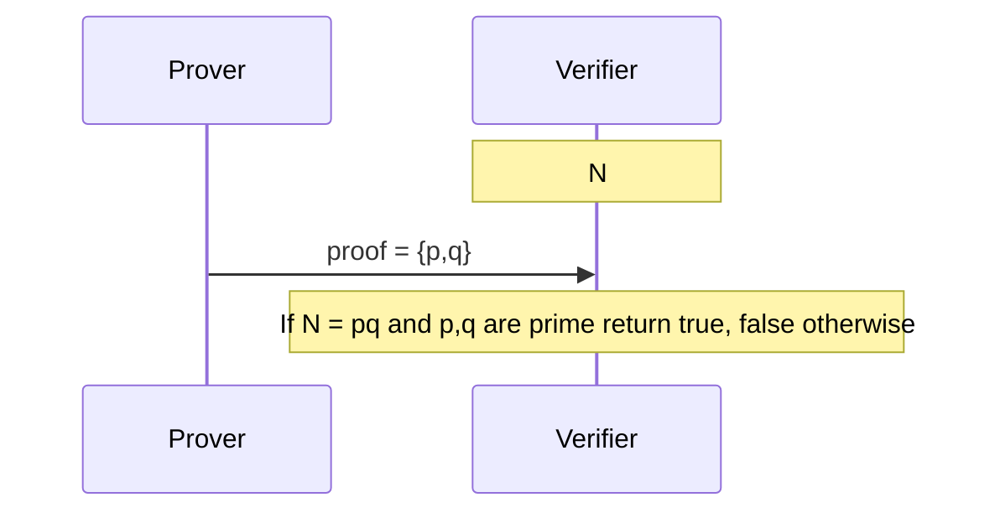
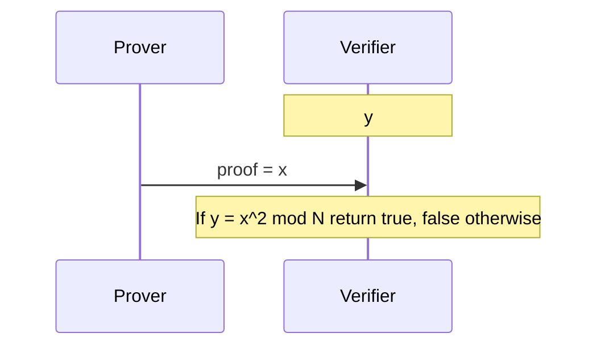

# Lecture 1: Introduction and History of Zero-Knowledge Proof
In questa lezione faremo un'introduzione alle Zero-Knowledge Proof e alla loro storia.

## Proof
Il primo concetto che dobbiamo formalizzare è quello di *dimostrazione*.
Nel contesto in cui ci troviamo, parleremo di dimostrazioni interattive in cui sono presenti due parti che condividono una *claim*. In particolare, le due parti coinvolte sono le seguenti:
- **Prover**: colui che deve fornire una prova del fatto che il fatto sia vero; assumeremo, almeno per il momento, che il Prover abbia capacità computazionali illimitate;
- **Verifier**:colui che deve verificare (accettare o rifiutare) la prova ottenuta dal *prover*; assumeremo che il verifier sia polinomialmente limitato;

## Efficiently Verifiable Proofs (NP-Proofs)
Le Efficiently Verifiable Proof (o NP-Proof) rappresentano delle prove in cui la prova è piccola e, di conseguenza, facilmente verificabile da parte del Verifier.
Formalmente, la taglia della prova deve essere polinomiale rispetto alla taglia della claim.

## Esempio 1
### Claim: $N$ è il prodotto di due numeri primi
In questo esempio vogliamo dimostrare che un numero $N$, noto al Prover e al Verifier, è un prodotto di due numeri primi $p,q$.

Il Verifier, una volta ricevuta la proof, potrà verificare la proprietà in tempo polinomiale (moltiplicazione $pq$ e test di primalità su $p$ e $q$).

Al termine dell'interazione, il Verifier conoscerà però la scomposizione in fattori primi di $N$.

## Example 2
### Claim: $\exists x \in Z_N^* : y = x^2 \, mod \, N$
In questo esempio vogliamo dimostrare che un numero $y$ è un quadrato residuo modulo $N$. Sappiamo che questo problema è difficile in $Z_N^*$.

Dopo l'interazione, il Verifier potrà verifcare che $y$ è un quadrato residuo modulo $N$ ma conoscerà anche la radice quadrata di $y$, ovvero $x$.

## Esempio 3
### Claim: due grafi sono isomorfi
Supponiamo di avere due grafi $G_0$ e $G_1$, diremo che questi sono isomorfi. Affinché due grafi $G_0,G_1$ siano isomorfi devono valere le seguenti condizioni:
1. hanno lo stesso ordine e la stessa dimensione (stesso numer di vertici e di archi);
2. hanno la stessa sequenza grafica, ovvero hanno lo stesso vettore ordinato dei gradi dei nodi componenti il grafo.

Ricordiamo che il grado di un nodo è il numero di nodi ai quali è collegato.

In questo caso, il Prover invia al Verifier l'isomorfismo $\pi = [N] \rightarrow [N]$. Il Verifier restituisce True se $$\forall i,j (\pi(i), \pi(j)) \in E_1 \iff (i,j) \in G_0$$

## Efficiently Verifiable Proofs (NP-Languages)
Gli esempi che abbiamo visto sono tutte NP-Proof.

Le claim che abbiamo visto sono, in realtà, linguaggi.

### Definizione di linguaggio
Un linguaggio $L$ è un insieme di stringhe binarie $x$ che soddisfano una qualche proprietà.

### Definizione di linguaggio NP
Un linguaggio $\mathcal{L}$ è un linguaggio *NP* (o NP-decision problem), se esiste un verifier $V$ polinomialmente limitato ($poly(|x|)$) per cui valgono le seguenti proprietà
- **Completeness** se $x \in \mathcal{L}$ esiste una prova poly($|x|$)-long $w \in \{0,1\}^* : V(x,w)=1$; 
- **Soundness** se $x \notin \mathcal{L} \forall w \in \{0,1\}^*, V(x,w) = 0$

